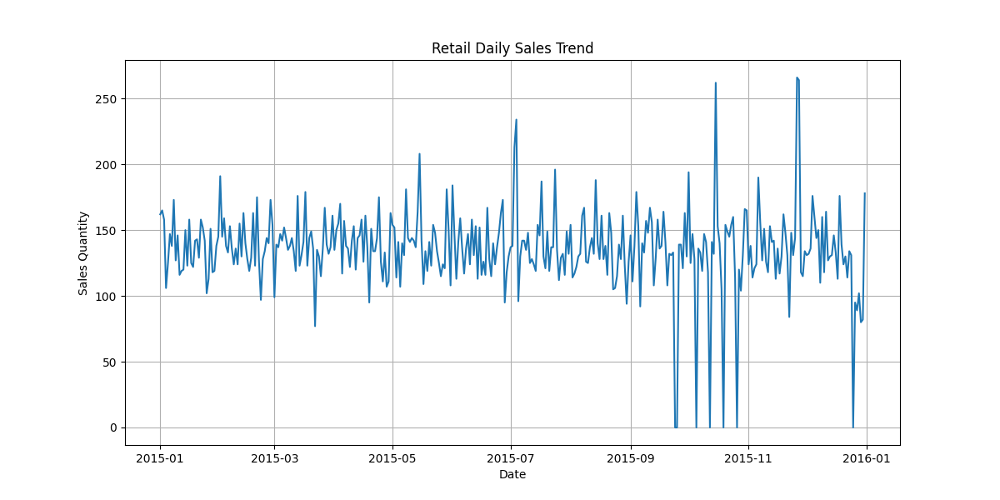
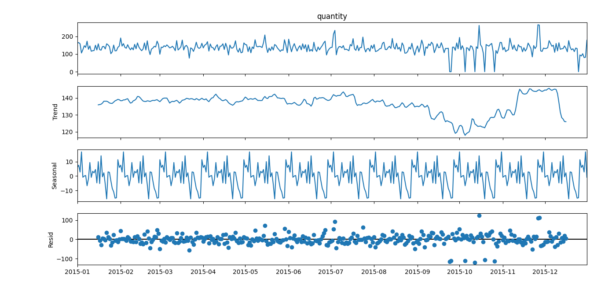
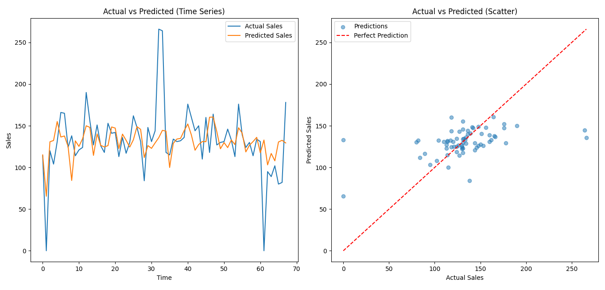
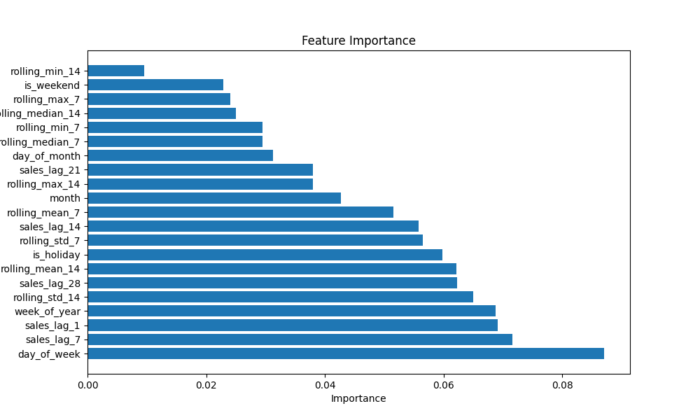

# 📊 Sales Forecasting Project

## 🧠 Overview
This project focuses on building a machine learning model to forecast future sales using historical data. The goal is to help businesses make data-driven decisions by predicting future demand and trends.

## Objectives
- Analyze historical sales data
- Perform data cleaning and preprocessing
- Engineer meaningful time-based features
- Train and evaluate models
- Generate accurate sales forcasts

---

## ✅ Completed

### 📌 Week 1: Data Processing
- Loaded and explored dataset  
- Handled missing values  
- Converted date columns to datetime  
- Cleaned and structured the dataset 
- EDA plots

### 📌 Week 2: Feature Engineering
- Created date-based features (year, month, day, weekday)  
- Generated lag features (e.g., previous 7-day sales)  
- Created rolling statistics (moving averages)  
- Added basic time-based indicators  
- Split dataset into training and testing sets (80%/20%)

### 📌 Week 3: Model Training and Selection
- Trained mutiple models:
    1. Baseline Model (linear regression)
    2. Random Forest
    3. XGboost 
- Perform Hyperparameter Tuning
- Selected best model based on performance metrics

### 📌 Week 4: Moadel Evaluation
- Evaluated models using:
    - Mean Absolute Error (MAE)
    - Root Mean Squared Error (RSME)
- Compared model predictions against actual values
- Visualized performance using:
    - time series plots (Actual vs Predicted)
    - Scatter plots
- Analyzed feature importance 

---

## 🛠️ Tools Used
- Python  
- Pandas  
- NumPy 
- statsmodels
- scikit learn
- XGboost 
- Matplotliib

---

## 📁 Project Structure
├── src/ │   ├── data_processing.py       # Data cleaning, transformation & EDA │   
├── feature_engineering.py   # Feature creation and selection │   
├── model_training.py        # Model training and hyperparameter tuning │  
└── model_evaluation.py      # Evaluation metrics (MAE, RMSE) │ 
├── main.py                      # End-to-end pipeline (outside src folder) |
├── data/                        # Raw and processed datasets |
├── images                       # All plots(EDA, feature importance, actual vs predicted etc) |
├── requirements.txt             # Contain all python liberies needed for this project |
└── README.md                    # Project documentation

---
## 📊 Results Visualization

### Sales Trend

### Seasonal Decomposition

### Actual vs Predicted

### Feature Importance

---
## ⚠️ Limitations
- Only **12 months of data** available  
- Limited ability to learn long-term seasonality  
- No external variables (weather, promotions, etc.)  

---

## 🔮 Future Improvements
- Incorporate more historical data  
- Add external features (weather, promotions etc..)   
- Explore deep learning models (LSTM, GRU)  
- Deploy as an API or dashboard  

---

## ▶️ How to Run

### Install dependencies
pip install -r requirements.txt

### Run pipeline
python main.py

---

## 💼 Business Impact

This project goes beyond model building and demonstrates how machine learning can support real business decisions:

- 📦 **Inventory Optimization**  
  Helps businesses stock the right quantity and reduce overstock or stockouts  

- 📈 **Demand Forecasting**  
  Enables better planning based on expected future sales trends  

- 💰 **Cost Reduction**  
  Minimizes losses from unsold inventory and poor demand estimation  

- 📊 **Data-Driven Decision Making**  
  Transforms raw sales data into actionable insights  

Despite working with a limited dataset, the pipeline shows how forecasting models can be applied in real-world retail scenarios.

## Author
Ademola Joseph  
Data Scientist | Mechanical Engineer  
Email: josephkayode672@gmail.com
GitHub: https://github.com/Josephkayode672